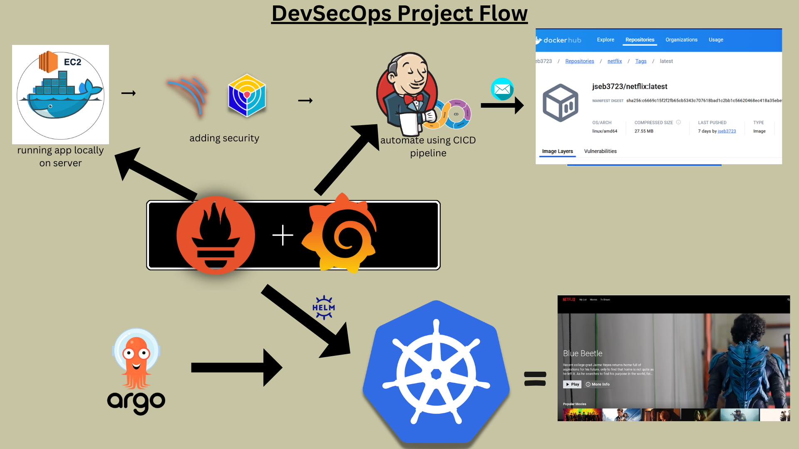
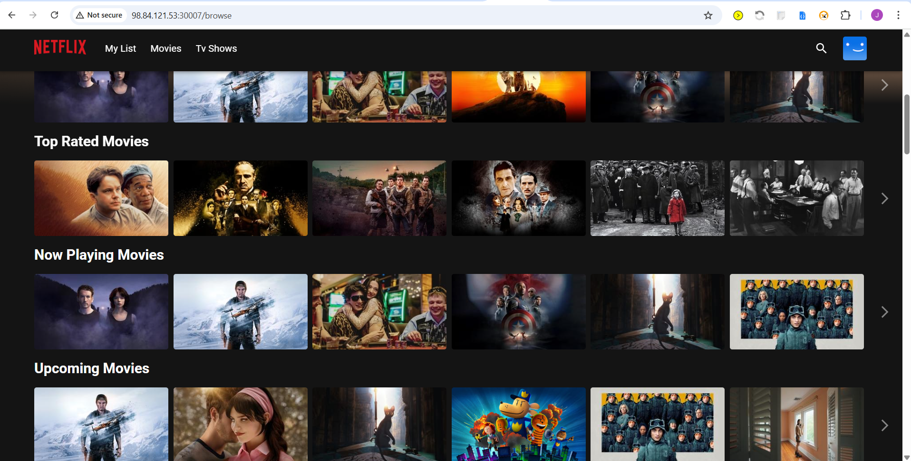

<h1 align="center">One-Click DevOps Platform Deployment</h1>

  Full DevSecOps pipeline with GitHub Actions, Kubernetes (AKS), ArgoCD, Prometheus & Grafana

  <b> Designed for recruiters: Run everything with ONE CLICK</b>

##  One-Click Deployment

Follow these steps:

1. Click the button below 'run pipeline'
2. Go to "Run workflow"
3. Click "Run workflow" again
4. Wait ~10-15 minutes
5. Access the job "deploy"
6. Inspect the step "Install Tools and Deploy" the last line will contain info needed to see demo
7. Access the elements with the info given

### resources will be deleted in 10 minutes after deployment, I don't want to maintain (pay $$$) anything :D

  

## What this project demonstrates

This is NOT just a frontend demo.

It showcases a real-world DevOps workflow:

- ✅ Infrastructure as Code (Terraform)
- ✅ Containerization (Docker)
- ✅ CI/CD (GitHub Actions)
- ✅ Kubernetes deployment (AKS)
- ✅ GitOps (ArgoCD)
- ✅ Monitoring (Prometheus + Grafana)
- ✅ Secure & automated provisioning

## Architecture

1. GitHub Actions triggers pipeline
2. Docker builds application image
3. Terraform provisions AKS
4. Kubernetes deploys workloads
5. ArgoCD manages GitOps sync
6. Prometheus collects metrics
7. Grafana visualizes data

## Workflows

This repository contains multiple pipelines:

|    Workflow     |            Purpose        |
|-----------------|---------------------------|
| Image (ci.yml)  | Build & push Docker image |
| Infra (cd.yml)  | Deploy AKS with Terraform |
| Full(ci_cd.yml) |   End-to-end deployment   |

## Observability

- Prometheus metrics collection
- Grafana dashboards

## Why this project matters

This project simulates a real production-ready DevOps workflow:

- Automated infrastructure provisioning
- GitOps-based deployments
- Scalable Kubernetes architecture
- End-to-end observability

Built to demonstrate real DevOps engineering skills — not just theory.

##  Application Preview

  

   
    

 

  
  
Home Page

